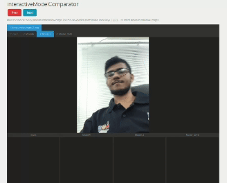

# Interactive Model Comparator

This tool allows you to interactively compare output images from different machine learning models for a specific (computer vision) task, tested with the same dataset. 

<p align="center">
  
</p>


## Features

- **Interactive Comparison**: Keep output images from different models in the `static/images` folder. When you run the project, an image box will be displayed with tabs for each of your models. You can switch tabs by clicking the tab name or pressing the keys `[1]`, `[2]`, etc.
- **Preview and Zoom**: Move the mouse over any position of the image to see a preview of all models below the main image box. Use the mouse wheel to zoom in/out. Use the Next/Prev buttons to change the image.
- **Configurable Models**: Easily configure which models' outputs you want to compare and visualize by editing the configuration file.

## Assumptions

- All models are tested using the same dataset, so the image names are the same across all model outputs. Refer to the dummy images for an example.

## Installation

### 1. Clone the Repository

First, clone the repository to your local machine:

```bash
git clone https://github.com/kawchar85/InteractiveModelComparator.git
cd InteractiveModelComparator/
```

### 2. Set Up a Virtual Environment
Create and activate a virtual environment using Python

```bash
python3 -m venv venv
source venv/bin/activate
```

### 3. Install Dependencies
Install the required dependencies:

```bash
pip install "fastapi[standard]"
```

## Run the Project
1. Place the output image folders inside the static/images folder.
2. Open the **config.json** file and add the names of the models you want to visualize and compare.
    ```js
    {
        "model": ["input", "ModelA", "Model_Z", "Model_2048"]
    }
    ```
3. Activate the virtual environment if it's not already activated:
    ```bash
    source venv/bin/activate
    ```
4. Start the application:
    ```bash
    bash start.sh
    ```
5. Open your browser and go to [http://localhost:8585/](http://localhost:8585/) or [http://0.0.0.0:8585/](http://0.0.0.0:8585/).


## Contributing

If you encounter any bugs, please create an issue. If you want to fix a bug, modify an existing feature, or add new features, you are welcome to contribute!

### How to Contribute

1. **Fork the Repository**: Fork the repository to your GitHub account.
   
2. **Clone Your Fork**: Clone your forked repository to your local machine.

   ```bash
   git clone https://github.com/your-username/InteractiveModelComparator.git
   ```

3. **Create a New Branch**: Make a new branch for your changes.

   ```bash
   git checkout -b your-branch-name
   ```

4. **Make Your Changes**: Implement your changes, whether fixing a bug or adding a new feature.

5. **Commit and Push**: Commit your changes with a descriptive message and push to your fork.

   ```bash
   git add .
   git commit -m "Descriptive message about your changes"
   git push origin your-branch-name
   ```

6. **Create a Pull Request**: Open a pull request from your fork to the original repository (this repo).
